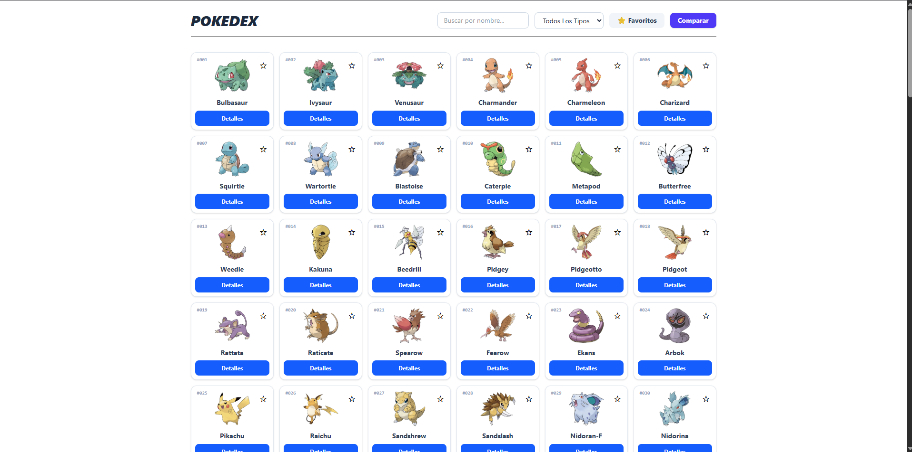
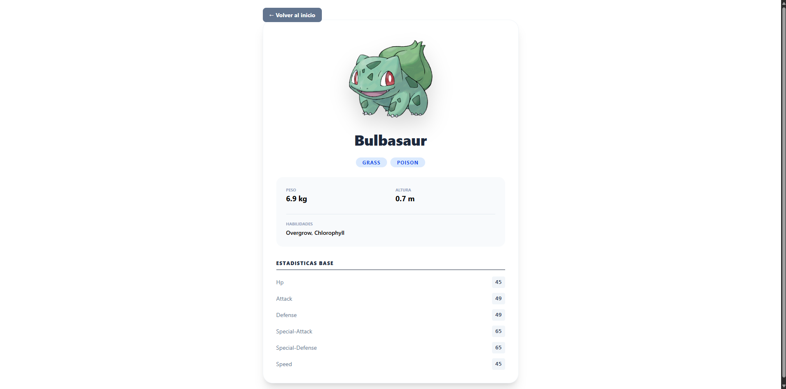
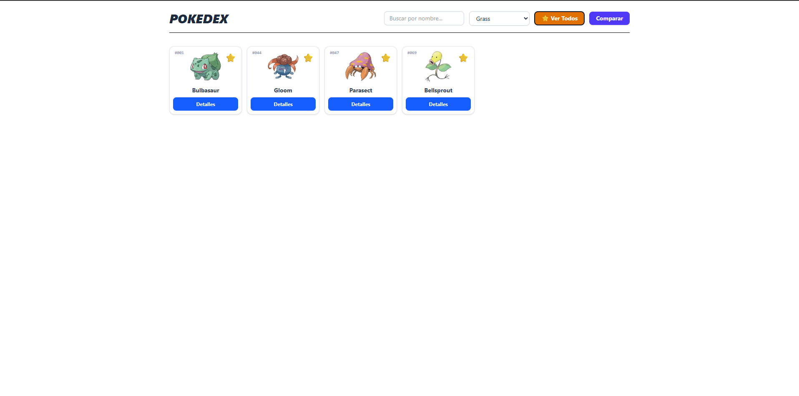
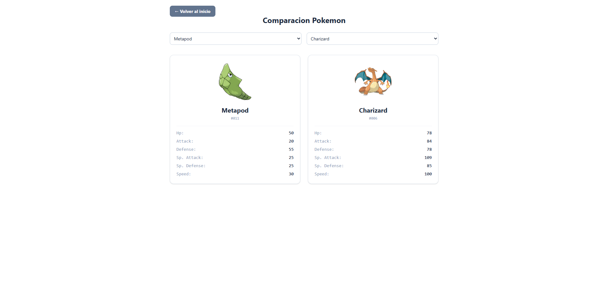

# PokeAPI

### **Desarrollador:** Nain Santiago Ayon Nava

---

## Descripcion breve del proyecto
Aplicacion web responsiva conectad a la PokeAPIque permite a los usuarios ver una lista de los primeros 151 pokemones
(1ra generacion). Pueden ver detalles como sus estadisticas base, buscarlo por medio de filtro, marcarlos como favoritos o comparar dos pokemones.

---

## Tecnologias utilizadas
* **React 18:** Biblioteca base para la interfaz.
* **Vite:** Servidor de desarrollo.
* **TypeScript:** Tipado estricto.
* **Tailwind CSS:** Estilos.
* **React Router DOM:** Manejo de rutas (`/`, `/pokemon/:name`, `/compare`).
* **PNPM:** Gestor de paquetes.

---

## Instrucciones de instalacion
Sigue estos pasos para configurar el entorno local:

1. **Clonar el proyecto** (o acceder a la carpeta raiz del codigo fuente):
  ```bash
   cd pokedex
  ```
2. **Instalar el PNPM**
  ```bash
   pnpm install
  ```

---

## Comandos para ejecutar el proyecto
1. **Estar dentro de pokedex**
  ```bash
   cd pokedex
  ```
2. **Ejecutar el siguiente comando**
  ```bash
   pnpm dev
  ```

---

## Funcionalidades implementadas
* **Catalgo con paginacion:** Carga inicial controlada directo de los servidores de la PokeAPI.
* **Buscador:** Filtrado por coincidencia de caracteres en los nombres del Pokemon.
* **Filtro por tipo:** Clasificacion segun los tipos de los pokemones.
* **Favoritos locales:** Guardado de datos por medio del uso de localeStorage.
* **Comparacion:** Menu que permite elegir y mostrar los detalles de dos pokemones al mismo tiempo.

--- 

## Capturas de pantalla

### Listado de Pokemones

### Detalles del Pokemon

### Filtros del Pokemon

### Comparacion de los Pokemon


---

Muchas gracias por leer :D